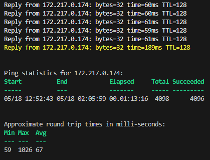

Important Note
==============
This version of PingIt is has been tested to work on both Windows and Linux, but for Linux see the caveat addressed in the **Note** below. 

Introduction
============

PingIt grew out of the need to be able to provide hard evidence of outages and latency problems to my ISP. By default, it will collect various statistics about any outages encountered while it is running. If latency issue detection is enabled, then various latency-related statistics will also be captured.

Documentation
=============

To run PingIt, all that is required is a ping target, e.g. Invoke-PingIt google.com. While running, the ping output will appear similar to:  
Reply from 172.217.0.174: bytes=32 time=58ms TTL=112

If timestamps are wanted, supply the Timestamps switch parameter, e.g. Invoke-PingIt google.com -Timestamps

If Count is not supplied or is 0, then the target will be pinged until Ctrl-C is pressed.

If one of the latency issue detection features are enabled, it will collect various statistics about the latency as well. These statistics will be based upon one of two approaches:
1. If a value for LatencyThreshold > 0 is supplied and the LatencyMovingAvg switch parameter is supplied, then whenever the moving average of the latency is >= LatencyThreshold for >= LatencyWindow (default of 5) pings a latency tracking record will be created and stats will be gathered for that record until such time as the moving average falls below the threshold.
e.g. Invoke-PingIt google.com -LatencyThreshold 100 -LatencyMovingAvg
2. If a value for LatencyThreshold > 0 is supplied and the LatencyMovingAvg switch parameter is not supplied, then whenever the latency of a ping is >= LatencyThreshold. a latency tracking record will be created and if the threshold is met or exceeded sequentially for >= LatencyWindow packets, that record would become permanent. e.g. if LatencyThreshold were 100 and LatencyWindow were at its default of 5, then if there were 4 packets in succession which met or exceeded LatencyThreshold followed by a packet which did not, then no permanent record would be created, but if there were 5 or more pings in succession where the latency was >= LatencyThreshold, then a permanent record would be created.  
e.g. Invoke-PingIt google.com -LatencyThreshold 100

The alias for Invoke-PingIt is PingIt.

Screenshots
===========
- Normal ping output. If latency exceeds the value specified in LatencyThreshold, the ping output will be in yellow text.  
  
- Sample latency summary and detail when moving average is utilized for tracking. When there are more than three records, the longest latency period will be highlighted in red and the shortest in yellow.  
  
- Sample outage summary and detail. When there are more than three records, the longest outage period will be highlighted in red and the shortest in yellow.  
  

Requirements
============

- PowerShell 6.0 or higher.

Installation
============
Install-Module PingIt

**Note**
As of 2023/05/17, PingIt works on both Windows and Linux. However, on the latter due to the fact that Test-Connection is broken at this time on that platform, it will only work if run with super user privileges. [See](https://github.com/MicrosoftDocs/PowerShell-Docs/issues/8684)
